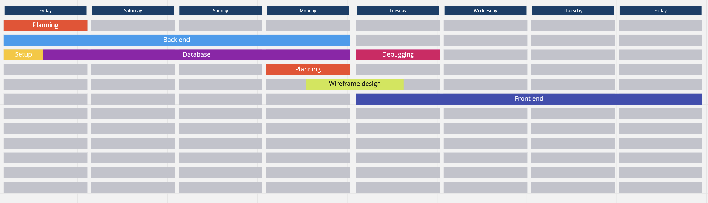
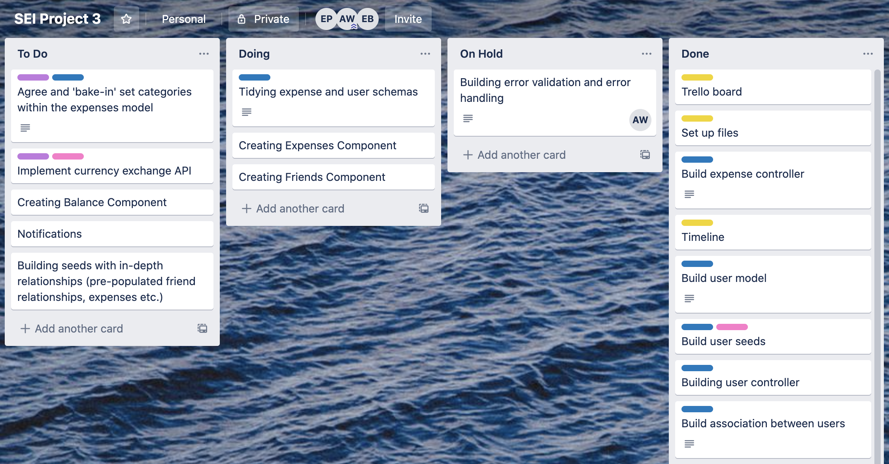
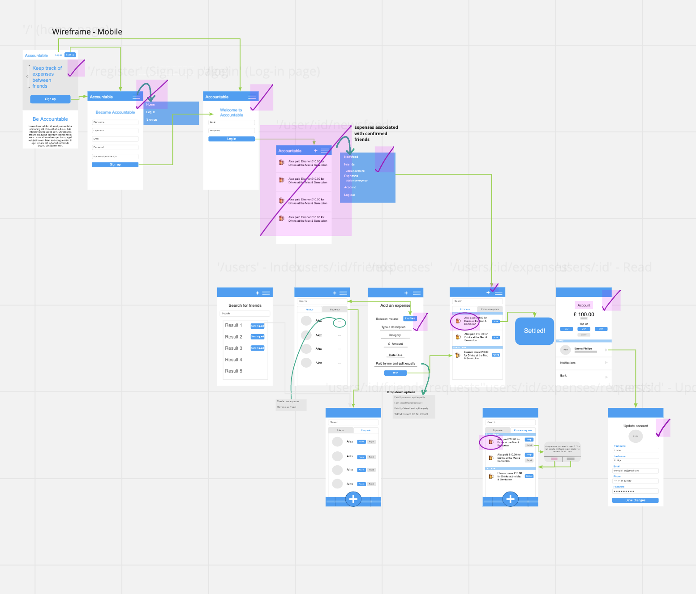
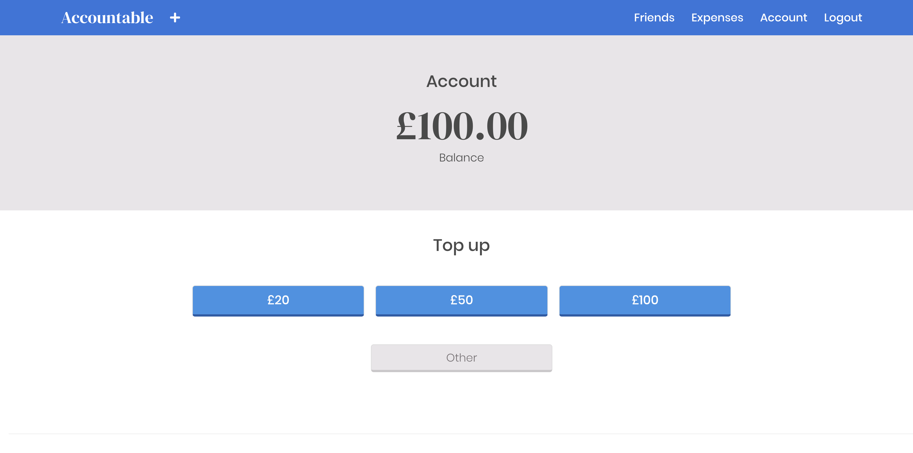

# Project three: Accountable

## Overview

The third project for the course was to build a full stack application using **MongoDB**, **Express**, **React** and **Node.js**. Working in a small group, we wanted to create an expense sharing app similar to Splitwise, but with an improved and more social user experience. The key feature was enabling users to hold funds within the app, so they could easily transfer to friends that they owed.

The final result can be found at: https://splitexpenses.herokuapp.com/.

To install and run this app, make sure you have NPM and run  `npm install` to get started!

## Table of contents

* [Brief](#Brief)
* [Build](#Build)
* [Final product](#Final-product)
* [Wins and challenges](#Wins-and-challenges)
* [Bugs](#Bugs)
* [Conclusion](#In-summary)

## Brief

### Technical requirements

* **Build a full stack application** 
* **Use an Express API** to serve data from a Mongo database
* **Consume your API with a separate front-end** built with React
* **Be a complete product** which means multiple relationships and CRUD functionality
* **Implement thoughtful user stories/wireframes** 
* **Be deployed online** and accessible to the public.

### Languages and technologies used

* Mongoose
* MongoDB
* Express
* React
* Node.js
* NPM
* Axios
* Bcrypt
* JSON web tokens
* Cloudinary - photo storage

## Build

### Timeline

This is the timeline that we held ourselves to:



### Day one

We spent the first day planning and wireframing, using Trello to organise tasks... 



and Miro to map and design the user experience...



### Day two through four

We dedicated roughly three days to building the back-end of the application with the models for friends, expenses and users allocated to each of the team members. We wanted to give ourselves a decent amount of time on this part of the project, as it was our first time building an entire back-end. Also, due to the interconnectedness of the models, we wanted to make sure that we were careful in our approach and to thoroughly test that the models performed nd stored information as expected.

At the end of day four, we hooked up the back-end to the front-end to start development on the latter the next day.

### Day five to eight

The front end involved quite a bit of logic as this is where we carried out the bulk of validations to allow certain functions within the application. For example, this is where we checked that a user was confirmed friends with another in order to raise an expense.

It was during these four days that we began to feel the time pressure of development as we hadn't left ourselves enough time fully flesh out the design of Accountable - at least to my exacting standards. This was most apparent on the morning of submission. We spent a large chunk of the morning debugging part of the friendSearch component, which had minimal styling due to the fact that the page wasn't rendering properly. We were able to resolve the issue roughly one hour before the deadline, which triggered a mad dash to structure and test the design of the friendSearch page.

## Final product


### App

For this project, we kept our models quite simple as the relationships between them were more complex. Since we had Splitwise as our starting point, we looked at the app, how it functioned, what we liked about it and what we thought could be improved to aid user experience. One of the points of improvement we determined was that the app does not allow users to pay other directly via the platform. If on mobile, users have to navigate to their bank app to set up payment, and they likely have to access messaging apps with the details of the person or persons that they owe - this constant juggling in order to make a single payment is easily remedied by enabling users to transfer and hold funds within Accountable. Then, when they wanted to settle a debt, it was as simple as clicking a button. 

Overview of the app:

* Users must create an account in order to use Accountable
* Once they join, they are able to add funds into their account balance. As this was part of an assignment, we used a simple increase and decrease functionality - the app mimics the experience were it to actually connected to a user's bank account
* Users may search other users to connect as friends
* Once friend requests hae been accepted, then users can start to raise expenses with their connections
* Accountable keeps a ledger of expenses owed by/to users as well as expenses settled by each user
* Expenses and friends can be accessed through their respective dashboards

### My contribution

I oversaw the user models within the back-end and how it connected to the friends and expenses models in order for the app to function properly, testing various requests through Insomnia. I carried this through to the front-end where I managed the account pages, allowing users to see their balance, 'top up' or 'transfer' funds between their bank, update their profile picture and information, and set their notification preferences (NB we were unable to implement notifications during development, so this an anticipated future feature).

The user model was central to the application as it acted as the central model for bringing together the friend as well as expense models: 

```
const userSchema = new mongoose.Schema({
  firstName: { type: String, required: true },
  lastName: { type: String, required: true },
  email: { type: String, required: true },
  password: { type: String, required: true },
  phoneNumber: { type: String, required: true, unique: true },
  image: { type: String },
  balance: { type: Number, default: 0 },
  friends: [friendsSchema],
  expenses: [referenceExpenseSchema]
}, 
{ timestamps: true })
```
The user's balance was one of the bigger features of the account page on the front-end, where users could top-up:



To top-up, users only needed to click one of the provided options. The below code, handled the logic to determine which button was selected. Firstly, it checked that it was not 'Other', which triggered a different functionality, then it would increment the balance before showing a toast notification that the operation had been successful.

```
  handleClick = async event => {
    try {
      if (event.target.value === 'Other') {
        this.setState({ showInput: true })
      } else {
        const userId = this.props.match.params.id
        const requestData = { ...this.state.requestData, amount: event.target.value }
        const res = await changeBalance(userId, requestData)
        notify.show('Balance successfully topped up', 'success', 1500)
        this.setState({ user: res.data })
      }
    } catch (err) {
      console.log(err.response)
    }
  }
  ```

If 'Other' was selected, an input appeared which allowed users to enter a unique amount. Once submitted, the changeBalance function was called, passing userId and the unique value.

One of the small details that I worked on across the account pages and the rest of the application, was to incorporate favicons to improve user experience and add a visual beyond just text. I used Font Awesome having worked with it in the previous project.

I also took on the design concept along with quite a bit of its implementation with the front-end.

## Wins and challenges

### Wins

A personal win from this project was how it really solidified my understanding of React. We were still working with classical components, and there were a couple occasions where information needed to pass down from the state of a parent component through a couple child and grandchild components. One example that comes to mind is the text input option on the account and bank pages to declare a unique amount to add or subtract from the user's Accountable balance. The input is it's own component which sits as a child within one page and a grandchild on the other, therefore the logic for the input sits with the highest component in the tree. In the end, it was really rewarding to be able to understand and manipulate the data to carry out the various functions.

### Challenges 

Reflecting after the fact, the biggest challenge for this project was time management. We were meticulous in our planning at the beginning of the project, but because this was our first full stack application, we were unsure how much time to dedicate between front and back-end development. We opted to split our time between them, so 3.5 days on the back-end and 3.5 days on the front end. While we were successful in the end, I think we would have benefitted from shifting our timelines a bit earlier and only spending two days creating the back-end, which would have given us more time to build the front of the application and to do a bit more robust testing. This is a lesson that I carried forward to the next group project, which was hugely beneficial to what we were able to produce in project four.

I also think that MongoDB was a bit of a hinderance in this project, and that it probably would have been better served by a SQL database in order to keep track of expenses between users.

### Bugs

We tested the application thoroughly and accounted for many edge cases, so there aren't any apparent bugs in terms of functionality. The only one that comes to mind is more design related. Due to time constraints, we were unable to properly style the pages associated with the friend components. To me, some of the items could be improved by adjusting the margin/padding and playing with the alignment in relation to other elements.

### Future content

New features would include:

* Notifications to alert users when a new expense has been raised, outstanding expenses, etc. along with the option to customise the alerts users receive
* Groups so that expenses can be split beyond the current offering which is only between individuals
* Messaging to allow users to interact with each other more within the app
* News feed to act as a landing page and show activity amongst users' friends

## In summary

This was likely one of the most stressful projects of the course in terms of time management. We doggedly stuck to our initial timeline which saw us split our time equally between front and back-end. While we were able to deliver a complete and working application in the end, I felt that we would have benefitted from dedicating more time to the front-end. As this was our third project of four, I made sure to carry this lesson into the final project.
